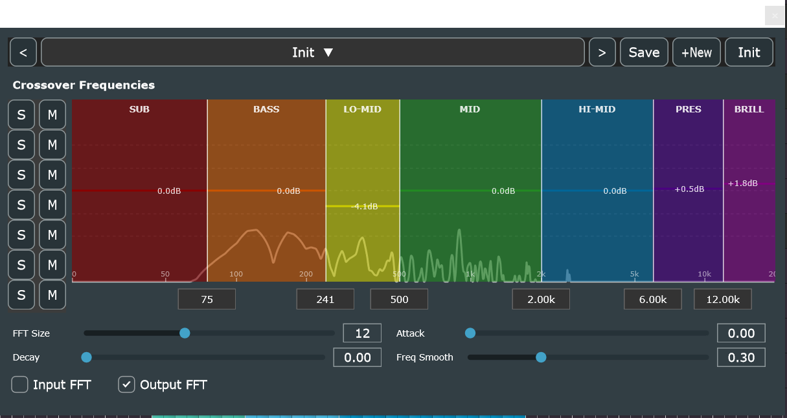

# phu-splitter

JUCE-based **VST3 audio effect** that splits a stereo input into **7 frequency bands** using Linkwitz-Riley crossover filters.

Each band is output as a separate stereo channel, enabling multiband processing workflows in a DAW.



## Features

- **7-band Linkwitz-Riley crossover** with 48 dB/octave slopes
- **Draggable crossover frequency bar** — click and drag dividers on a logarithmic frequency axis
- **Draggable amplify/attenuator bar** — click and drag horizontal line in each band to amplify/attenuate it's output
- **Editable frequency text boxes** — double-click to type a value in Hz, kHz, or **musical note names** (e.g. `C#3`, `E#1`, `Ab4`)
- **Preset system** — save, load, rename, and delete presets; navigate with prev/next buttons
- **Full DAW automation** — crossover frequencies are exposed as automatable parameters
- **State save/restore** — all settings are persisted with the DAW session

## Installation (Windows)

> **Prerequisite:** The plugin requires the **Microsoft Visual C++ 2015–2022 Redistributable (x64)** to be installed on the host machine.
> Download: [vc_redist.x64.exe](https://aka.ms/vs/17/release/vc_redist.x64.exe) — already present if Visual Studio 2019 or 2022 is installed.

## Build (CMake + Visual Studio)

This repo is set up for CMake presets.

### Windows

- Configure: `cmake --preset vs2026-x64`
- Build Debug: `cmake --build --preset debug`
- Build Release: `cmake --build --preset release`

### Linux

See [docs/LINUX_BUILD.md](docs/LINUX_BUILD.md) for detailed instructions.

Quick start:
```bash
sudo bash scripts/install-linux-deps.sh  # Install dependencies
cmake --preset linux-release              # Configure
cmake --build --preset linux-build        # Build
```

The target built by the presets is `phu-splitter_VST3`.

## Audio Processing

The plugin uses **Linkwitz-Riley crossover filters** to split the incoming stereo audio into 7 frequency bands:

| Band | Range | Colour |
|------|-------|--------|
| Sub bass | < 80 Hz | Dark red |
| Bass | 80 – 250 Hz | Burnt orange |
| Low-mid | 250 – 500 Hz | Yellow |
| Mid | 500 – 2000 Hz | Forest green |
| Upper-mid | 2000 – 6000 Hz | Steel blue |
| Presence | 6000 – 12000 Hz | Indigo |
| Brilliance | > 12000 Hz | Purple |

Each band is output to a separate stereo bus, allowing independent processing in your DAW.

### Default Crossover Frequencies

| Split | Frequency |
|-------|-----------|
| Sub bass / Bass | 80 Hz |
| Bass / Low-mid | 250 Hz |
| Low-mid / Mid | 500 Hz |
| Mid / Upper-mid | 2000 Hz |
| Upper-mid / Presence | 6000 Hz |
| Presence / Brilliance | 12000 Hz |

All crossover frequencies are adjustable via the UI or DAW automation.

### Note Name Input

Crossover frequencies can be entered as musical note names using equal-temperament tuning (A4 = 440 Hz):

- `A4` → 440 Hz
- `C#3` → 138.59 Hz
- `E#1` → 43.65 Hz (enharmonic of F1)
- `Db3` → 138.59 Hz (enharmonic of C#3)

Sharps (`#`, `##`), flats (`b`, `bb`), and octaves 0–9 are supported.

## Preset System

Presets are stored as XML files in `%APPDATA%/PhuSplitter/Presets/`.

- **Init** — built-in default preset (cannot be deleted or overwritten)
- **Save / Save As** — save current crossover frequencies to a named preset
- **Delete / Rename** — manage saved presets from the dropdown menu
- **Prev / Next** — step through presets sequentially

## Implementation Details

- **Linkwitz-Riley filters**: 8th order (48 dB/octave) crossovers implemented using cascaded biquad filters in Direct Form I
- **Phase coherent**: Allpass compensation ensures flat magnitude response when all bands are summed
- **Multi-output architecture**: 1 stereo input → 7 stereo output buses
- **Real-time safe**: Lock-free logging system for editor updates from audio thread
- **Note-to-frequency conversion**: Header-only `NoteToFreq` utility in `lib/`

## Project Structure

| Path | Description |
|------|-------------|
| `src/LinkwitzRileyFilter.h` | Core DSP — biquad filters, LR crossovers, MultiBandN |
| `src/PluginProcessor.cpp/.h` | Audio processor with APVTS parameter management |
| `src/PluginEditor.cpp/.h` | Plugin editor UI layout |
| `src/CrossoverFrequencyBar.cpp/.h` | Draggable frequency bar with text input |
| `src/PresetManager.cpp/.h` | Preset storage engine |
| `src/PresetStrip.cpp/.h` | Inline preset navigation UI |
| `lib/NoteToFreq.h` | Musical note name → frequency converter |
| `lib/` | Event system library (see `lib/README.md`) |
